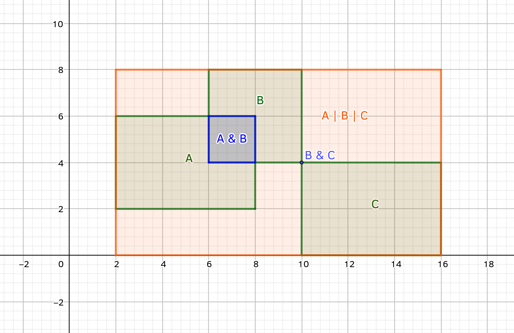

# pyraxial

[](https://pypi.org/project/pyraxial/)
[](https://github.com/pillmuncher/pyraxial/blob/main/LICENSE)
[](https://codecov.io/gh/pillmuncher/pyraxial)

An algebraic approach to axis-aligned rectangles with a focus on correctness and mathematical elegance.

## Installation

```bash
pip install pyraxial
```

## Quick Start

```python
from pyraxial import Rect

# Create rectangles (left, top, right, bottom)
r1 = Rect(0, 0, 100, 100)
r2 = Rect(50, 50, 150, 150)

# Find bounding box using the | operator
bbox = r1 | r2  # Rect(0, 0, 150, 150)

# Find intersection using the & operator
overlap = r1 & r2  # Rect(50, 50, 100, 100)

# Work with multiple rectangles
rects = [Rect(0, 0, 50, 50), Rect(25, 25, 75, 75), Rect(100, 100, 150, 150)]
overall_bbox = Rect.bounding_box(*rects)

# Check containment and relationships
r1 >= Rect(25, 25, 75, 75)  # True (r1 contains the smaller rect)
r1 & r2 != Rect.EMPTY  # True (they intersect)
```

## Why pyraxial?

Working with bounding boxes often involves tedious coordinate manipulation and edge cases. pyraxial provides a clean, algebraic interface that:

- **Handles edge cases automatically**: Empty rectangles and degenerate cases just work
- **Provides intuitive operators**: Use `|` for union (bounding box) and `&` for intersection
- **Guarantees correctness**: Built on lattice theory with well-defined mathematical properties
- **Integrates easily**: Drop-in compatible with libraries like Pillow that use 4-tuples

## Use Cases

- **Image processing**: Compute bounding boxes for crops, object detection
- **UI layout**: Calculate overlaps and containment in graphical interfaces  
- **Collision detection**: Determine if and where rectangles intersect
- **Spatial algorithms**: Partition and group overlapping regions

## Core Features

### Binary Operations

The `|` (join) and `&` (meet) operators work intuitively:

```python
# | creates the smallest rectangle containing both
r1 | r2  # bounding box

# & creates the overlapping region (or EMPTY if no overlap)
r1 & r2  # intersection
```

### Identity Elements

```python
# EMPTY is the identity for |
r | Rect.EMPTY == r

# PLANE is the identity for &
r & Rect.PLANE == r
```

### Variadic Operations

```python
# Work with any number of rectangles
Rect.bounding_box(*rects)      # generalizes |
Rect.intersection(*rects)       # generalizes &
```

### Grouping Intersecting Rectangles

The `bounding_boxes()` method computes bounding boxes for all groups of transitively intersecting rectangles:

```python
rects = [
    Rect(0, 0, 10, 10),
    Rect(5, 5, 15, 15),    # intersects first
    Rect(100, 100, 110, 110)  # separate group
]

groups = Rect.bounding_boxes(rects)
# Returns bounding boxes for each connected component
```



### Containment and Intersection Checks

```python
# Check containment using comparison operators
r1 >= r2  # True if r1 contains r2 (r2 ≤ r1)
r2 <= r1  # True if r2 is contained in r1

# Check intersection
r1 & r2 != Rect.EMPTY  # True if rectangles overlap

# Check if empty
r == Rect.EMPTY  # True if rectangle has zero area
```

### Creating Rectangles

```python
# From coordinates (left, top, right, bottom)
r = Rect(0, 0, 100, 100)

# From iterables
r = Rect([0, 0, 100, 100])
r = Rect((0, 0, 100, 100))

# From point pairs
r = Rect.from_points((0, 0), (100, 100))

# Empty rectangles are created automatically for invalid inputs
Rect(100, 100, 0, 0) == Rect.EMPTY  # True
Rect([]) == Rect.EMPTY  # True
```

### Integration with Other Libraries

Rects work as drop-in replacements for 4-tuples:

```python
from PIL import Image

img = Image.open("photo.jpg")
crop_region = Rect(10, 10, 110, 110)
cropped = img.crop(crop_region)  # Works directly!

# Or use point pairs where needed
r = Rect(0, 0, 100, 100)
top_left, bottom_right = r.points
```

## Mathematical Properties

The `Rect` class forms a **complete lattice** under the `|` and `&` operations. This means it satisfies a rigorous set of algebraic laws that guarantee predictable, composable behavior.

### Lattice Laws

For all Rect objects a, b, and c:

**Identity:**
```
a | Rect.EMPTY  ==  a
a & Rect.PLANE  ==  a
```

**Absorption:**
```
a | Rect.PLANE  ==  Rect.PLANE
a & Rect.EMPTY  ==  Rect.EMPTY
```

**Idempotency:**
```
a | a  ==  a
a & a  ==  a
```

**Commutativity:**
```
a | b  ==  b | a
a & b  ==  b & a
```

**Associativity:**
```
(a | b) | c  ==  a | (b | c)
(a & b) & c  ==  a & (b & c)
```

**Absorption:**
```
a | (a & b)  ==  a
a & (a | b)  ==  a
```

### Partial Order Properties

The lattice structure induces a partial order (≦) where `a ≦ b` means "a is contained in b":

**Bounds:**
```
Rect.EMPTY ≦ a ≦ Rect.PLANE
```

**Reflexivity:**
```
a ≦ a
```

**Transitivity:**
```
a ≦ b  and  b ≦ c   ⟹   a ≦ c
```

**Antisymmetry:**
```
a ≦ b  and  b ≦ a   ⟹   a == b
```

**Monotonicity:**
```
a1 ≦ a2  and  b1 ≦ b2   ⟹   a1 | b1  ≦  a2 | b2
a1 ≦ a2  and  b1 ≦ b2   ⟹   a1 & b1  ≦  a2 & b2
```

**Semidistributivity:**
```
(a & b) | (a & c)  ≦  a & (b | c)
a | (b & c)  ≦  (a | b) & (a | c)
```

Note: The lattice is *not* distributive or modular, which is characteristic of geometric lattices.

## API Details

### Coordinates

Coordinates increase from left to right and top to bottom:
- `left ≤ right` and `top ≤ bottom` for non-empty rectangles
- If `left > right` or `top > bottom`, the result is `Rect.EMPTY`

### Immutability

`Rect` objects are immutable. All properties are read-only.

### Type Covariance

All methods return values that are covariant under subtyping, making `Rect` suitable for subclassing.

### Iterator Compatibility

`Rect()` and `bounding_boxes()` accept any iterable. However, the operators (`|`, `&`) work reliably only on sequence-like objects, not iterators. Using iterators with operators may cause undefined behavior.

## Documentation

Full API documentation: <https://pillmuncher.github.io/pyraxial>

## License

MIT License - see [LICENSE](LICENSE) file for details.
